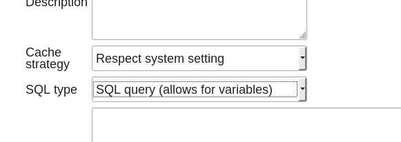

## Background
[DHIS2](https://www.dhis2.org/) is a FOSS health data management system used by many governments worldwide. 

> "DHIS2 is the world's largest health management information system (HMIS) platform, in use by 67 low and middle-income countries. 2.28 billion (30% of the world's population) people live in countries where DHIS2 is used." [See DHIS2 factsheet](https://www.dhis2.org/inaction)

Ministry of Health, Nepal (MOH) decided to
adopt the DHIS2 software as its official Health Management Information System (HMIS) after conducting technical reviews and pilot studies. Previous HMIS and EWARS sytem were migrated to DHIS2 platform in 2016. Electronic reporting from all health facilities is the end goal of MOH and many facilities are already reporting online via DHIS2. 

Having conducted multiple capacity development trainings to more than 300 health facilities on DHIS2, S2HSP (GIZ) realized a need for an interactive dashboard to get an overview and detailed data on electronic reporting status. This project was born out of this need.

## Technical Docs
### Data Source
Standard DHIS2 APIs are not sufficient/optimal to consume data required by this app. So, the app depends on two SQLViews that should be uploaded to DHIS2 and its IDs should be set in `.env.local` or `.env.production` file depending on the deployment. These two SQLViews are:

#### Primary View 
Generates aggregated counts of various reporting status

    - Filename: sqlViews/aggregated_main_with_unreported.sql

#### Secondary 
Generates individual health facilities with various reporting status

    - Filename: sqlViews/main_with_unreported.sql

Create both of these SQL Views in DHIS2 with the following parameters:

Once done, get IDs of SQLViews by querying the DHIS2 API from the browser at URL:

    http://localhost:8080/hmis/api/sqlViews

Replace `http://localhost:8080/hmis/` with the Base URL of your DHIS2 installation. 

Now, copy `.env` to `.env.local` and set IDs in the file as:

    REACT_APP_DHIS2_PRIMARY_SQLVIEW_ID="xxxxxxxxxxx"
    REACT_APP_DHIS2_SECONDARY_SQLVIEW_ID="xxxxxxxxxxx"

### Dependencies
Aside from the regular `yarn install`, this app requires a running DHIS2 instance, however it needn't be installed as a DHIS2 App during development. Once dependencies are installed, you can do just:

    yarn start

and check out the app at `http://localhost:3000`. Make sure that you're logged into DHIS2 in the same browser.

### Production Build
When creating a production build, you need to redo the same steps of creating SQL views and set IDs in `.env.production` file before running the following scripts.

Two scripts generate production `.zip` builds ready to be uploaded to DHIS2:

    yarn build_app
    yarn build_dashboard_widget

Both generate an `app.zip` file. So, be sure to copy the app build before generating the widget build.

This project was bootstrapped with [Create React App](https://github.com/facebookincubator/create-react-app). For developers familiar with CRA, this project doesn't deviate from it and thus, you should refer to official docs for any configuration changes.